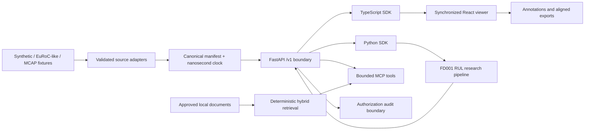
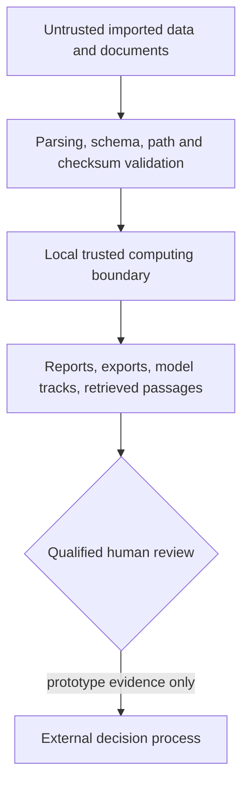

# Current architecture and evidence flow

Status reflects the source at this release candidate, not the historical roadmap.

The canonical manifest is the hinge: adapters preserve source provenance and clocks; the API exposes
versioned contracts; SDKs preserve nanosecond identity; the viewer, ML, and tool layers consume public
interfaces rather than database internals. Human approval is deliberately outside MCP.

## Trust and evidence boundaries

See [threat model](threat_model.md), [limitations](limitations.md), and the
[evidence index](../evals/reports/README.md). A rendered architecture SVG is in
[`docs/demo/architecture.svg`](demo/architecture.svg).
