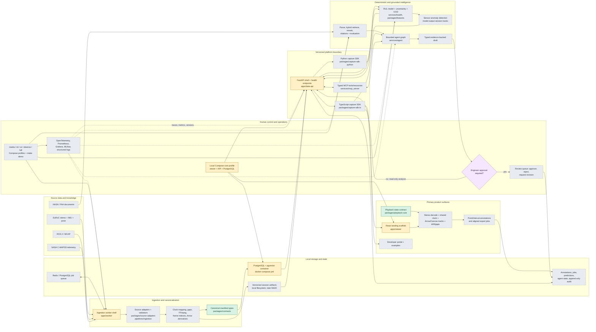

# AeroMaint Studio: system architecture and feature flow

> Status snapshot: 2026-08-03. This view reconciles the target architecture in
> `AeroMaint_AI_Project_Documentation.md` with the files currently present in the repository.
>
> **Implemented** means executable domain behavior exists and is tested. **Scaffolded** means a
> runnable shell, type shape, or configuration exists without the documented product behavior.
> **Planned** means the path and responsibility are proposed here from the project specification;
> the file or directory does not exist yet.

## What AeroMaint is, in plain language

AeroMaint is meant to turn several kinds of engineering data into one reviewable story. A camera
may record 20 frames each second while an inertial sensor records 200 readings each second. Engine
telemetry and technical manuals are different again. AeroMaint gives all of these sources common
rules, stores them safely, and lets people and software inspect the same information.

The finished flow is:

1. **Bring data in.** Import camera, sensor, engine, and document data from supported sources.
2. **Translate it.** Convert every source into AeroMaint's standard names, timestamps, and file
   descriptions.
3. **Store it.** Keep searchable records in a database and large files in artifact storage.
4. **Provide one public interface.** The API and SDKs give applications a stable way to request data.
5. **Review synchronized evidence.** The viewer shows video and sensor readings at the same moment.
6. **Add human work.** Reviewers can annotate a moment or range and export matching evidence.
7. **Run numerical models.** ML code estimates remaining engine life and detects unusual signals.
8. **Find supporting documents.** RAG retrieves relevant passages from approved NASA and FAA sources.
9. **Assemble an explanation.** A restricted agent calls approved tools and creates a cited draft.
10. **Keep people in control.** An engineer must approve any high-risk maintenance recommendation.
11. **Watch the system.** Logs, metrics, traces, and model records make failures and versions visible.
12. **Run it locally.** Docker Compose starts the required parts together on a developer's Mac.

### Status words used in this document

- **Implemented:** working code exists for this behavior and at least a focused test proves it.
- **Scaffolded:** the project has a starting shell, configuration, or type, but not the complete
  behavior described in the project plan.
- **Planned:** the project documentation describes the component, but its intended file or directory
  has not been created yet.

### Main concepts without jargon

| Concept                | Simple meaning                                                                                   | Why AeroMaint needs it                                                                        |
| ---------------------- | ------------------------------------------------------------------------------------------------ | --------------------------------------------------------------------------------------------- |
| Ingestion              | Reading an outside dataset and converting it into AeroMaint's format.                            | EuRoC, ROS/MCAP, C-MAPSS, and documents all arrive in different forms.                        |
| Source adapter         | A translator for one input format.                                                               | Each adapter can change without changing the viewer or SDK.                                   |
| Validation             | Checking that data is complete, ordered, correctly typed, and safe to publish.                   | Bad timestamps or missing files should fail clearly instead of producing misleading playback. |
| Canonical contract     | One agreed description of a session and its streams.                                             | Every part of the system can exchange data without knowing another part's internal code.      |
| Manifest               | A small file that lists a session's streams, time range, files, clocks, calibration, and origin. | Consumers can discover what is available before downloading large data.                       |
| Session clock          | The shared timeline used to compare every stream.                                                | A camera frame and an IMU reading can be shown at the same real session moment.               |
| Clock mapping          | The rule that converts a device's own timestamp into session time.                               | Different sensors may start at different values or drift apart.                               |
| Gap                    | A declared time range where valid data is missing.                                               | The viewer must show missing evidence instead of drawing a false continuous signal.           |
| Artifact               | A large versioned file such as video, Arrow sensor data, a model, or an exported clip.           | These files do not belong directly inside ordinary database rows.                             |
| PostgreSQL             | The relational database holding searchable metadata and changing workflow state.                 | It supports sessions, permissions, annotations, jobs, approvals, and audit records.           |
| pgvector               | A PostgreSQL extension for searching embedding vectors.                                          | It enables semantic document search without requiring a separate vector database.             |
| API                    | Server endpoints applications call over HTTP.                                                    | It validates requests and protects storage behind one supported boundary.                     |
| SDK                    | A friendly programming library built on the API.                                                 | Viewer and external developers get typed methods, cancellation, and consistent errors.        |
| Arrow                  | A compact binary format for column-based data.                                                   | Large sensor windows reach JavaScript efficiently without huge JSON responses.                |
| Downsampling           | Returning a smaller but representative set of points.                                            | A screen cannot usefully draw millions of samples for a few hundred pixels.                   |
| Frame index            | A lookup table from time to video frames and keyframes.                                          | Seeking can find the right decodable frame without scanning the whole video.                  |
| Shared playhead        | The single authoritative current time in the viewer.                                             | Individual videos cannot silently pull the session out of synchronization.                    |
| Drift                  | The difference between a stream's displayed time and the shared playhead.                        | The viewer can measure, display, and correct synchronization errors.                          |
| Seek generation        | A number assigned to each new seek request.                                                      | Slow results from an old seek can be discarded after the user seeks somewhere else.           |
| Annotation             | A human-created label attached to one time or time interval.                                     | Review findings stay connected to the exact evidence they describe.                           |
| Export                 | A reproducible package containing selected media, matching sensor data, and origin details.      | Another person can review or process the same evidence outside the viewer.                    |
| Provenance             | A record of where data came from and which code/version produced it.                             | Results can be traced and reproduced instead of becoming unexplained files.                   |
| RUL                    | Remaining useful life: a model's estimate of cycles left before simulated failure.               | It provides a deterministic numerical health signal for C-MAPSS engines.                      |
| Prediction interval    | A range around a prediction, not just one number.                                                | It communicates uncertainty rather than pretending the estimate is exact.                     |
| OOD check              | A test for input unlike the model's training data.                                               | The model can abstain instead of making an unsafe extrapolation.                              |
| Anomaly detection      | Finding sensor behavior that is unusual compared with expected patterns.                         | Reviewers can jump to suspicious time windows without treating them as proven faults.         |
| Model track            | A prediction or anomaly displayed on the same timeline as source data.                           | ML remains a normal consumer of platform contracts, not a private viewer integration.         |
| RAG                    | Finding relevant source passages before generating an answer.                                    | Technical statements can be grounded in approved NASA/FAA evidence.                           |
| Keyword search         | Searching for exact words and phrases.                                                           | It works well for part names, codes, and precise terminology.                                 |
| Vector search          | Searching by similarity of meaning.                                                              | It can find relevant passages that use different wording.                                     |
| Reranking              | Reordering search results with a more precise second pass.                                       | The strongest evidence fits within the limited context sent to the model.                     |
| Citation validation    | Checking that every citation was actually supplied as evidence.                                  | The system rejects invented or disconnected citations.                                        |
| Agent                  | A controlled workflow that chooses among approved tools.                                         | Different questions need different combinations of session, model, and search calls.          |
| MCP server             | A standard tool interface exposing AeroMaint capabilities to compatible AI clients.              | Tools remain typed, reusable, authorized, and separate from model prompts.                    |
| Tool budget            | A maximum number of calls or retries allowed in one run.                                         | It prevents loops, long waits, and uncontrolled resource use.                                 |
| Typed proposal         | A draft answer with required fields such as evidence, limitations, and approval status.          | Application code can validate it instead of accepting arbitrary model prose.                  |
| Human approval         | A required engineer decision before a high-risk draft becomes approved.                          | The LLM cannot authorize real action, and every decision receives an audit record.            |
| Idempotency            | Repeating the same mutation does not apply it twice.                                             | Network retries cannot create duplicate annotations, exports, or approvals.                   |
| Audit trail            | Append-only records of important actions and versions.                                           | Reviewers can see who did what, when, and using which evidence.                               |
| Observability          | Logs, metrics, and traces explaining system behavior.                                            | Developers can find slow requests, errors, model versions, and failed tool calls.             |
| Model registry         | A record of trained model files, data versions, metrics, and promotion state.                    | The system can explain which model produced a prediction and roll back safely.                |
| Docker Compose profile | A named group of local services started together.                                                | A small Mac can run only the components needed for a task.                                    |
| Modular monolith       | One repository with well-separated modules and only a few runtime processes.                     | It keeps the solo project manageable while preserving boundaries that could scale later.      |

## End-to-end architecture



The canonical manifest is the architectural hinge: adapters publish it; storage and API preserve
it; SDKs translate its timestamp strings to safe client types; the viewer and AI components consume
it without private database fields. Deterministic services own synchronization, range selection,
RUL, and anomaly scores. The agent may synthesize evidence, but cannot calculate health or approve
maintenance work.

Put more simply: every source is first translated into the same session description. The rest of
the product reads that description through the API and SDK. This prevents the viewer, models, and AI
tools from each inventing a different understanding of the data.

## Feature flows

### Capture review, annotation, and export

This flow covers the main product experience. The system first prepares a session. Later, the viewer
requests only the frame and sensor window needed for the visible part of the timeline. When a reviewer
marks an interval, the annotation is stored separately from the original data. An export job then
packages the selected video and the sensor readings covering exactly the same time range.

```mermaid
sequenceDiagram
  autonumber
  actor Reviewer
  participant Adapter as EuRoC / ROS adapter
  participant Worker as Ingestion worker
  participant Store as PostgreSQL + artifacts
  participant API as Data API
  participant SDK as TypeScript SDK
  participant Viewer as Synchronized viewer

  Adapter->>Worker: Source timestamps, frames, samples, calibration
  Worker->>Worker: Validate, normalize to signed ns, detect gaps/drift
  Worker->>Store: Atomic manifest + Arrow + media/index artifacts
  Reviewer->>Viewer: Open session and seek to time
  Viewer->>SDK: Manifest, frame-at, visible sensor window
  SDK->>API: /v1 session and range requests (cancellable)
  API->>Store: Resolve metadata and bounded artifact ranges
  Store-->>Viewer: Frame + downsampled Arrow window + gaps
  Viewer->>Viewer: Authoritative clock; render drift and missing data
  Reviewer->>Viewer: Create interval annotation and export range
  Viewer->>SDK: Idempotent annotation and export commands
  SDK->>API: Validated mutation with provenance
  API->>Store: Versioned annotation + asynchronous export job
  Store-->>Reviewer: Clip + aligned sensor artifact + export manifest
```

### Predictive maintenance, grounded copilot, and approval

This flow keeps numerical work separate from language generation. The health service calculates RUL,
uncertainty, and anomalies. Retrieval finds supporting documents. The agent combines those tool
results into a fixed output shape. If the output recommends maintenance action, it stays a draft until
an authorized engineer records a decision.

```mermaid
sequenceDiagram
  autonumber
  actor Engineer
  participant API as API / SDK boundary
  participant Health as RUL + anomaly services
  participant Retrieval as Hybrid RAG
  participant Agent as Bounded agent / MCP
  participant Review as Human review queue
  participant Audit as Persistent workflow + audit

  Engineer->>API: Ask about engine/session/time range
  API->>Health: Deterministic feature, RUL, interval, OOD, anomaly calls
  Health-->>Agent: Versioned numerical evidence (or abstention)
  Agent->>Retrieval: Approved query + metadata filters
  Retrieval-->>Agent: Reranked passages with stable citations
  Agent->>Agent: Build typed proposal; validate claims, citations, budgets
  alt Read-only analysis
    Agent-->>API: Observations, model assessment, evidence, limitations
  else Maintenance recommendation
    Agent->>Audit: Save draft and evidence snapshot
    Agent->>Review: Route draft; agent cannot approve
    Engineer->>Review: Approve, reject, or request revision
    Review->>Audit: Idempotent decision + approver + version
    Review-->>API: Final review state
  end
```

## Current-to-target component map

The table below answers three questions for each feature: what exists now, where the complete version
is expected to live, and what smallest useful step should be built next.

| Capability                        | Status                    | Current evidence                                                                                   | Planned target path(s)                                                                                  | Required next vertical slice                                                                                |
| --------------------------------- | ------------------------- | -------------------------------------------------------------------------------------------------- | ------------------------------------------------------------------------------------------------------- | ----------------------------------------------------------------------------------------------------------- |
| Repository/tooling                | Scaffolded                | `package.json`, `pnpm-workspace.yaml`, `turbo.json`, `pyproject.toml`, `Makefile`, lockfiles       | `.github/workflows/`, `scripts/`, `docs/runbook.md`                                                     | Make combined local check and clean bootstrap demonstrably pass in CI.                                      |
| Canonical timestamps and manifest | Implemented (minimal)     | `packages/contracts/src/index.ts`; precision test in `packages/contracts/tests/manifest.test.ts`   | `packages/domain/`, `docs/capture_manifest.md`, schema files under `packages/contracts/schemas/`        | Add timebase, artifacts, calibration, clocks, gaps, provenance, runtime validation, and JSON naming policy. |
| Playback coordinator              | Implemented (state only)  | `packages/playback-core/src/index.ts`                                                              | Extended `packages/playback-core/`; `packages/timeline-renderer/`, `packages/arrow-streams/`            | Add reducer, seek generations, loop/buffers/drift and deterministic tests.                                  |
| Source ingestion                  | Scaffolded                | Worker entry point only: `apps/worker/src/aeromaint_worker/main.py`                                | `packages/source-adapters/`, `pipelines/ingestion/`, `tests/media-fixtures/`                            | Import one deterministic EuRoC fixture and publish a validated canonical manifest.                          |
| Storage                           | Scaffolded                | PostgreSQL/pgvector service and volume in `docker-compose.yml`; database URL is passed to API      | `infrastructure/compose/`, migrations, artifact layout under runtime data root                          | Add migrations/repositories and atomic manifest publication; decide filesystem-to-MinIO boundary.           |
| Data API                          | Scaffolded                | FastAPI app and live/ready endpoints in `apps/data-api/src/aeromaint_api/main.py`; one health test | Domain routers/modules inside `apps/data-api`; OpenAPI contract tests                                   | Serve one canonical session manifest and distinguish dependency-aware readiness from liveness.              |
| TypeScript SDK                    | Planned                   | No SDK package; viewer does not call the API                                                       | `packages/capture-sdk-ts/`                                                                              | Implement client + sessions/streams with cancellation, typed errors, and manifest parsing.                  |
| Python SDK                        | Planned                   | No SDK package                                                                                     | `packages/capture-sdk-python/`                                                                          | Follow stabilized TS contract for notebook and ML range access.                                             |
| Synchronized viewer               | Scaffolded                | `apps/viewer/` renders a static platform overview                                                  | `packages/timeline-renderer/`, `packages/arrow-streams/`, viewer feature modules/workers                | Display two fixture streams and IMU on one authoritative playhead through the public SDK.                   |
| Annotations and exports           | Planned                   | No schema, endpoint, UI, or job implementation                                                     | Viewer feature modules; API annotation/export routers; worker export jobs; `packages/contracts` schemas | Point/interval annotation plus one aligned sensor export with immutable provenance.                         |
| Predictive RUL                    | Planned                   | No dataset, feature, training, inference, or registry code                                         | `packages/telemetry/`, `packages/features/`, `pipelines/training/`, `services/health/`, `evals/ml/`     | Reproducible FD001 baseline with engine-level split and versioned prediction contract.                      |
| Anomaly detection                 | Planned                   | Mentioned only in documentation and landing copy                                                   | `services/health/`, `packages/features/`, `evals/ml/`                                                   | Publish anomaly windows as ordinary model-output session tracks.                                            |
| RAG                               | Planned                   | No corpus, parser, index, retrieval, citation, or evaluation code                                  | `packages/retrieval/`, `pipelines/documents/`, `evals/rag/`                                             | Index approved small corpus; hybrid retrieval with stable citation IDs and injection tests.                 |
| Agent orchestration               | Planned                   | No workflow or typed output implementation                                                         | `services/agent/`, `evals/agent/`                                                                       | Bounded read-only flow using deterministic prediction and retrieval tools; fail safely.                     |
| MCP                               | Planned                   | No MCP server                                                                                      | `services/mcp_server/`                                                                                  | Expose schema-validated read tools first; gate writes with authorization and idempotency.                   |
| Human approval                    | Planned                   | No recommendation, role, decision, or audit persistence                                            | Agent/API review modules; viewer review queue; database migrations                                      | Persist draft + evidence snapshot; enforce engineer-only idempotent decision.                               |
| Observability/MLOps               | Scaffolded (logging only) | `structlog` dependency and one worker startup event                                                | `packages/observability/`, `infrastructure/prometheus/`, `infrastructure/grafana/`, MLflow profile      | Shared trace IDs and structured API/worker metrics before adding model services.                            |
| Local deployment                  | Scaffolded                | Core Compose includes viewer, API, PostgreSQL; Dockerfiles; `make up-core`                         | Add worker to core; `infrastructure/local-release/`; media/ml/ai/observe/full profiles                  | Correct the core profile, add migrations/seed/readiness, and implement `make demo`.                         |
| Developer experience              | Scaffolded                | README prerequisites and startup commands                                                          | `apps/developer-portal/`, `examples/`, generated OpenAPI/SDK docs, migration guide                      | A TS CLI must consume the packaged SDK against the seeded API.                                              |
| Testing/evaluation                | Scaffolded                | One manifest precision test and one API health test                                                | `tests/`, `evals/`, browser performance and contract suites                                             | Test the first manifest-through-SDK vertical slice, then add deterministic media tests.                     |

## Contract and dependency rules

1. **One public seam.** Ingestion, API, SDK, viewer, model tracks, MCP tools, and exports share the
   versioned capture-session contract. No consumer reaches directly into storage tables.
2. **One authoritative clock.** Signed 64-bit nanoseconds are decimal strings in JSON and `bigint`
   in TypeScript. Floating-point time is restricted to bounded rendering windows.
3. **Immutable raw data.** Annotations, predictions, and exports are versioned overlays with source,
   schema, model, and pipeline provenance.
4. **Deterministic numerical ownership.** The platform selects ranges and frames; ML services
   calculate RUL and anomalies; the LLM only coordinates and synthesizes typed evidence.
5. **Human-controlled mutation.** High-risk recommendations remain drafts. Authorization,
   idempotency, approval state, and audit events are enforced outside prompts.
6. **Optional intelligence.** The viewer/API/SDK core remains useful when ML, retrieval, or a local
   LLM is unavailable. Failures degrade to deterministic evidence or explicit abstention.

In everyday terms, these rules keep responsibilities clear. Raw evidence is not rewritten. The API is
the front door. The session clock decides what “now” means. Numerical code produces numbers. The LLM
produces language from approved evidence. A person controls high-risk decisions.

## Documentation-to-code mismatches

These are not necessarily bugs yet. They are places where the future-state design promises more than
the current foundation implements, or where two current descriptions disagree.

- The specification calls the canonical manifest the shared, rich public contract, but the current
  TypeScript interface includes only session/stream identity, range, kind, clock ID, and count. It
  lacks timebase, artifacts/codecs, calibration, gaps, provenance, nominal rates, clock mappings,
  schema references, and runtime validation.
- The documentation examples use snake_case JSON (`schema_version`, `session_id`, `start_ns`), while
  `CaptureSessionManifestJson` currently expects camelCase. A wire-format policy and explicit mapping
  are needed before OpenAPI and SDK publication.
- README says the initial stack includes TanStack Query, but the viewer package currently has no
  query client usage and renders only a static landing page.
- README says PostgreSQL stores platform state, but the API has no database setting in its `Settings`
  model, no connection, migrations, repository layer, or readiness dependency check. Compose passes
  `DATABASE_URL`, which is presently ignored because settings accept only the `AEROMAINT_` prefix.
- The documented `core` profile is viewer + API + PostgreSQL + worker, but `docker-compose.yml` omits
  the worker service entirely.
- `make demo`, `make seed-demo`, `make ci`, backup/restore/reset, and media/ml/ai/observe/full Compose
  profiles are specified but do not exist. `Makefile` currently offers bootstrap, dev, check, test,
  up-core, and down.
- The repository tree promised in Section 23 is mostly future-state: developer portal, SDKs,
  adapters, feature/retrieval/observability packages, services, pipelines, evals, examples,
  infrastructure directories, system docs, and broad test suites are absent.
- Liveness and readiness return the same unconditional response. The documented readiness contract
  requires dependency-aware status.
- The worker is a logging entry point, not a queued ingestion/media job processor. It also is not
  started by Compose.
- No annotations, exports, predictive ML, anomaly detection, RAG, agent, MCP, human approval,
  authorization, audit trail, metrics, or model registry behavior is implemented yet.
- The documentation's Section 22 wording refers to an “implemented local operating profile,” but the
  repository only has an initial core scaffold and no published startup/resource/recovery
  measurements. Treat scaling and performance numbers as targets, not current claims.

## Recommended implementation dependency order

```mermaid
flowchart LR
  P0["0 · Foundation checks"] --> P1["1 · Rich manifest + EuRoC fixture"]
  P1 --> P2["2 · Manifest API + TypeScript SDK"]
  P2 --> P3["3 · Shared-clock viewer MVP"]
  P3 --> P4["4 · Windowing, Arrow, media performance"]
  P4 --> P5["5 · ROS/MCAP + annotations + exports"]
  P5 --> P6["6 · RUL + anomaly model tracks"]
  P6 --> P7["7 · RAG + bounded agent + MCP + approval"]
  P7 --> P8["8 · Observability + local release profiles"]
```



This ordering preserves the product claim: the viewer and SDK validate the public platform contract
before predictive and generative systems become downstream consumers.

The reason for this order is simple: first prove that one real session can travel safely from an
adapter, through the API and SDK, into a synchronized viewer. Once that shared path works, annotations,
models, retrieval, and agents can reuse it. Building AI first would leave the core data interface
untested and encourage private shortcuts between services.
